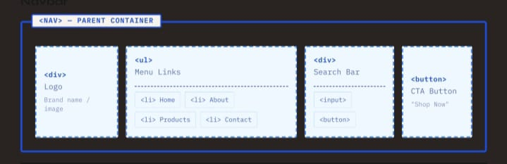
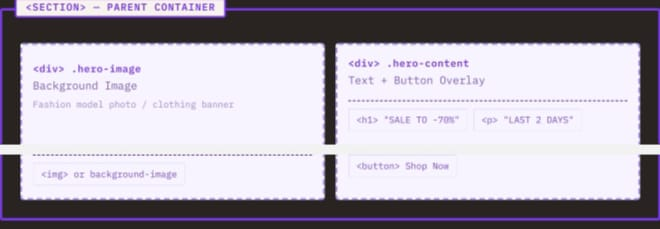
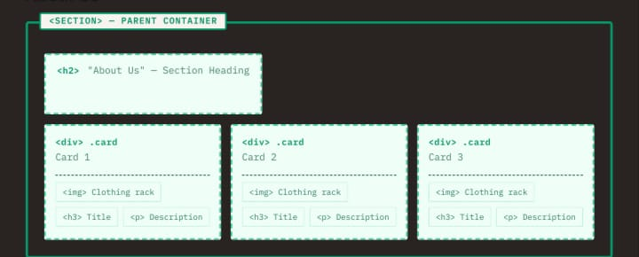
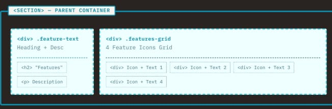
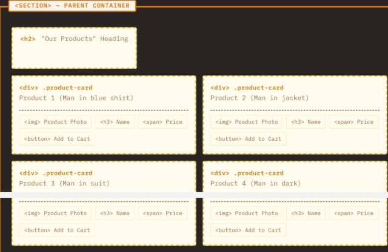
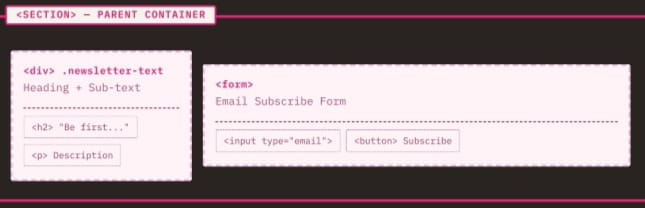
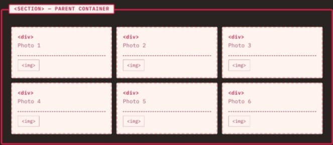
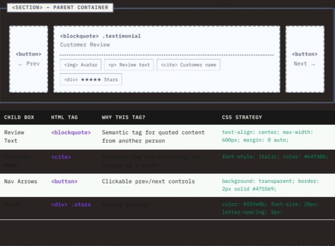
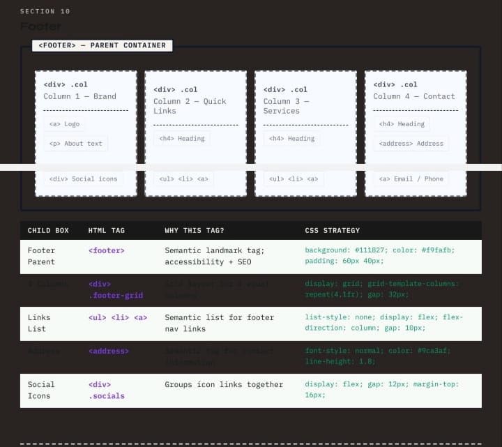

Assignment 2 – Box Mapping
Name: Bisma Ashfaq

SECTION 1: NAVBAR

1. Screenshot

2. Parent Child Hierarchy

Box Name| HTML Tag| Description
Navbar| "<nav>"| Main navigation container
Logo| "
" / "<a>"| Website logo
Menu Links| "<ul>"| Navigation menu
Search Bar| "<input>"| Search field
CTA Button| "<button>"| Action button

3. CSS Properties

Property| Purpose
display:flex| Horizontal layout
justify-content| Space between items
align-items| Vertical alignment
gap| Space between elements

---

SECTION 2: HERO SECTION

1. Screenshot

2. Parent Child Hierarchy

Box Name| HTML Tag
Hero Section| "<section>"
Hero Image| "
"
Hero Content| "
"
Heading| "<h1>"
Paragraph| "
"
Button| "<button>"

3. CSS Properties

Property| Purpose
background-image| Banner image
background-size:cover| Full cover image
position:relative| Parent positioning
position:absolute| Text overlay

---

SECTION 3: ABOUT US

1. Screenshot

2. Parent Child Hierarchy

Box Name| HTML Tag
About Section| "<section>"
Section Title| "<h2>"
Cards Wrapper| "
"
About Card| "
"
Image| ""
Title| "<h3>"
Description| "
"

3. CSS Properties

Property| Purpose
display:flex| Card layout
gap| Card spacing
flex-direction| Column layout
object-fit| Image fitting

---

SECTION 4: FEATURES

1. Screenshot

2. Parent Child Hierarchy

Box Name| HTML Tag
Features Section| "<section>"
Feature Grid| "
"
Feature Item| "
"
Icon| ""
Title| "<h3>"

3. CSS Properties

Property| Purpose
display:grid| Grid layout
grid-template-columns| Multiple columns
gap| Grid spacing

---

SECTION 5: PRODUCTS

1. Screenshot

2. Parent Child Hierarchy

Box Name| HTML Tag
Products Section| "<section>"
Product Grid| "
"
Product Card| "
"
Product Image| ""
Product Name| "<h3>"
Price| ""
Button| "<button>"

3. CSS Properties

Property| Purpose
display:grid| Product layout
border-radius| Rounded corners
object-fit| Image sizing

---

SECTION 6: NEWSLETTER

1. Screenshot

2. Parent Child Hierarchy

Box Name| HTML Tag
Newsletter Section| "<section>"
Form| "<form>"
Email Input| "<input>"
Subscribe Button| "<button>"

3. CSS Properties

Property| Purpose
display:flex| Form layout
border-radius| Rounded input
padding| Internal spacing

---

SECTION 7: LATEST NEWS

1. Screenshot

2. Parent Child Hierarchy

Box Name| HTML Tag
News Section| "<section>"
News Grid| "
"
News Card| "<article>"
Date| "<time>"
Description| "
"

3. CSS Properties

Property| Purpose
display:flex| Card layout
overflow:hidden| Clean design

---

SECTION 8: COLLECTION

1. Screenshot

2. Parent Child Hierarchy

Box Name| HTML Tag
Collection Section| "<section>"
Collection Grid| "
"
Photo Item| "
"
Image| ""

3. CSS Properties

Property| Purpose
display:grid| Gallery layout
aspect-ratio| Square images
object-fit| Proper image display

---

SECTION 9: TESTIMONIALS

1. Screenshot

2. Parent Child Hierarchy

Box Name| HTML Tag
Testimonial Section| "<section>"
Review Text| "<blockquote>"
Customer Name| "<cite>"
Navigation Button| "<button>"

3. CSS Properties

Property| Purpose
text-align:center| Center content
margin:auto| Center block

---

SECTION 10: FOOTER

1. Screenshot

2. Parent Child Hierarchy

Box Name| HTML Tag
Footer| "<footer>"
Footer Grid| "
"
Links List| "<ul>"
Address| "<address>"
Social Icons| "
"

3. CSS Properties

Property| Purpose
display:grid| 4-column layout
gap| Column spacing
background| Footer background

---

Conclusion

This assignment helped in understanding:

- HTML Semantic Tags
- Parent Child Hierarchy
- CSS Flexbox
- CSS Grid
- Positioning
- Box Model
- Responsive Layout Concepts

Submitted By

Bisma Ashfaq
